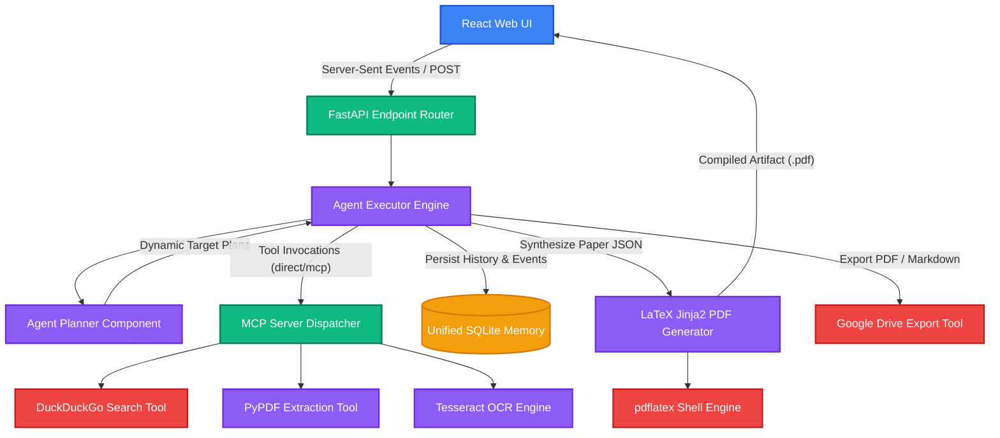
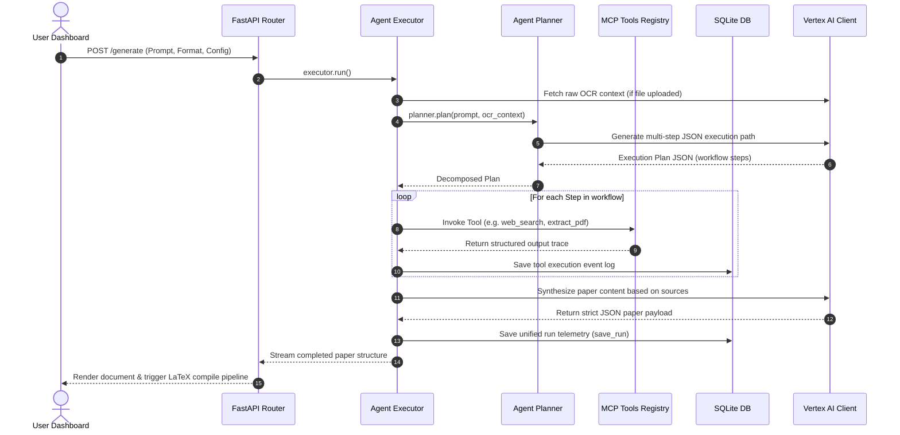

<p align="center">
  
</p>

<h1 align="center">⚡ AUTONOMOUS RESEARCH AGENT</h1>

<p align="center">
  <b>A state-of-the-art, production-ready multi-agent system powered by Gemini 2.5 and Model Context Protocol (MCP) to automate the academic research lifecycle—from literature gathering to publication-quality LaTeX compiling.</b>
</p>

<p align="center">
  <a href="https://github.com/virubot/Autonomous-Research-Agent/actions"></a>
  <a href="https://github.com/virubot/Autonomous-Research-Agent/blob/main/LICENSE"></a>
  <a href="https://vitejs.dev/"></a>
  <a href="https://fastapi.tiangolo.com/"></a>
</p>

<p align="center">
  <a href="#-overview">Overview</a> •
  <a href="#-features">Features</a> •
  <a href="#-system-architecture">Architecture</a> •
  <a href="#-multi-agent-workflow">Agent Loop</a> •
  <a href="#-research--pdf-pipeline">LaTeX Pipeline</a> •
  <a href="#-project-structure">Project Directory</a> •
  <a href="#-quick-start">Quick Start</a> •
  <a href="#-api-documentation">API Docs</a> •
  <a href="#-security">Security</a>
</p>

---

## 🚀 Overview

The **Autonomous Research Agent** is a professional-grade research engineering platform designed to automate literature search, document analysis, and formatted writing. The platform converts complex technical topics or raw uploaded source files into comprehensive, submission-ready academic papers compliant with major academic classes: **IEEEtran**, **acmart (ACM)**, and **apa7**.

### The Core Problem Solved
Traditional AI research workflows are fragmented, requiring manual web searches, manual citation formatting, copy-pasting into text processors, and fighting LaTeX compile environments. The Autonomous Research Agent resolves this by linking:
- **Intelligent Planning:** The `AgentPlanner` decomposes requests into goal-directed workflows.
- **Dynamic Tool Dispatching:** The agent executes complex tools in both native execution pathways and Model Context Protocol (MCP) server configurations.
- **Rigorous Data Consolidation:** A unified SQLite-backed memory store maintains telemetry, event flows, and literature traces.
- **High-Fidelity Document Generation:** A secure Jinja2-to-LaTeX compiler automatically handles formatting, table generation, equations, citation injection, and multi-pass compilation.

---

## ✨ Features

| Feature Class | Capabilities | Realized Technologies |
| :--- | :--- | :--- |
| **🤖 Autonomous Agent Core** | • Dynamic planning & execution traces<br>• strict JSON-schema compliance<br>• Fail-soft retry policies & fallback capabilities | `AgentPlanner`, `AgentExecutor`, Gemini 2.5 Flash / Lite |
| **🔌 Model Context Protocol** | • Extensible MCP server architecture<br>• Dynamic runtime tool registry & discovery<br>• Standardized JSON-RPC tool transport | `MCPServer`, `backend/mcp/dispatcher.py` |
| **📚 Document Processing & OCR** | • Raw text extraction from multipage PDFs<br>• Tesseract OCR parsing of uploaded visual graphics<br>• Automatic text normalization and file ingestion | `pypdf`, `pytesseract`, `Pillow` |
| **🔬 Publication-Grade LaTeX Engine** | • Automatic Jinja2-to-LaTeX template rendering<br>• Double-pass compilation to resolve cross-references<br>• Native template styles: IEEEtran, ACM art, APA7 | `pdf_generator.py`, `latex_utils.py`, `pdflatex` |
| **💾 Persistent Observation Store** | • Consolidated database for execution traces<br>• Document registry tracking source snippets & logs<br>• Full task run history hydration | SQLite (`agent_memory.db`, `agent_events.db`) |
| **🎨 obsidian-Intelligence Dashboard** | • Real-time markdown rendering & code blocks<br>• Interactive Server-Sent Event (SSE) progress streams<br>• Live Mermaid diagram visualization | React 18, Vite, Shadcn UI, Framer Motion, Mermaid.js |

---

## 🧠 System Architecture

The framework consists of a React client, a multi-threaded FastAPI REST engine, a custom Model Context Protocol dispatcher, and a dedicated LaTeX compiler environment.



---

## 🤖 Multi-Agent Workflow

Every research cycle undergoes a strict planning, ingestion, tool execution, and synthesis pipeline coordinated by the `AgentExecutor`.



---

## 📄 Research & PDF Pipeline

Converting unstructured raw search findings or source text into standard academic documents requires a highly defensive parsing, citation normalization, and template formatting process.

```mermaid
flowchart TD
    classDef step fill:#1e293b,stroke:#475569,stroke-width:2px,color:#f8fafc;
    classDef process fill:#0f172a,stroke:#3b82f6,stroke-width:2px,color:#3b82f6;
    classDef output fill:#1e1b4b,stroke:#6366f1,stroke-width:2px,color:#a5b4fc;

    A[Unstructured Data / Web Search Snippets]:::step --> B[deduplicate_sources Heuristic]:::process
    B --> C[assign_ref_ids [S1], [S2]...]:::process
    
    D[Raw Section Paragraph Data]:::step --> E[clean_content Paragraph Filter]:::process
    E -->|Strip section numbers & empty blocks| F[normalize_paper_data Validation]:::process
    
    C --> F
    F --> G[build_bibliography_block Python-side]:::process
    G -->|Ensures no raw JSON leaks| H[Jinja2 LaTeX Source Rendering]:::process
    
    H --> I[compile_latex_to_pdf pdflatex Engine]:::process
    I -->|Run Pass 1: generate aux files| J[pdflatex Compile Pass 2]:::process
    J -->|Resolves cross references & labels| K[Final IEEE / ACM / APA PDF]:::output
```

### Key Technical Implementations
1. **Defensive Formatting Validation:** The backend uses `pdf_generator.py` to filter out any generic placeholder text, empty paragraphs, and redundant numbering patterns automatically.
2. **Strict Bibliography Isolation:** To prevent JSON characters from leaking into raw LaTeX code, the bibliography is composed directly in Python utilizing `_build_bibliography_block` before injecting the escaped string block into the template source.
3. **Escaping Injection Hazards:** Every textual citation snippet is passed through `latex_escape` to safely escape `&`, `%`, `_`, `{`, `}`, and `$` signs, preserving raw math blocks safely enclosed within `\\( ... \\)`.

---

## 📂 Project Structure

```bash
/Users/viren/Documents/Code/Research agent/
├── backend/                   # FastAPI Server Engine
│   ├── agent/                 # Core Autonomous Execution Logic
│   │   ├── executor.py        # System coordinator, orchestrates tool states & generation
│   │   ├── planner.py         # Plan synthesizer utilizing Vertex AI JSON generation
│   │   └── memory.py          # SQLite database wrapper for execution persistence
│   ├── mcp/                   # Model Context Protocol Server Implementation
│   │   ├── dispatcher.py      # MCP action routing layer
│   │   ├── models.py          # Strict Pydantic interface structures
│   │   ├── registry.py        # Tool registration and validation engine
│   │   └── server.py          # Server transport and setup hooks
│   ├── routes/                # FastAPI Endpoints
│   │   ├── generate.py        # Stream and standard post executors
│   │   └── upload.py          # OCR & PDF parsing routers
│   ├── templates/             # Academic document classes
│   │   └── latex/             # Jinja2 templates (ieee.tex.j2, apa.tex.j2, acm.tex.j2)
│   ├── tools/                 # Execution Tools Interface
│   │   ├── search.py          # Web crawling and search integration
│   │   ├── pdf.py             # PyPDF text extraction
│   │   ├── image.py           # PyTesseract OCR extraction
│   │   └── drive.py           # Google Drive OAuth / Service Account uploader
│   ├── utils/                 # General-purpose utility packages
│   │   ├── gemini.py          # Vertex AI Client for Gemini 2.5 Flash / Lite
│   │   ├── latex_utils.py     # Escape routines for LaTeX compilations
│   │   ├── reference_utils.py # Bibliography clean & normalize functions
│   │   └── config.py          # Unified pydantic settings provider
│   └── main.py                # Server entry point, exception handlers, MCP registers
│
├── frontend/                  # React Vite Application
│   ├── src/
│   │   ├── components/        # UI Modular Elements
│   │   │   ├── PaperGenerator.tsx   # Paper controls, template selectors & page length
│   │   │   ├── ChatSidebar.tsx      # Sidebar displaying persistence run history
│   │   │   ├── ChatMessage.tsx      # Message block displaying Markdown, tables, & Mermaid
│   │   │   └── MermaidRenderer.jsx  # Dynamic Mermaid parser & graph container
│   │   ├── pages/             # Layout Containers (e.g. Index.tsx)
│   │   ├── hooks/             # Reactive Custom Hooks
│   │   ├── lib/               # Utility functions (e.g. API client endpoints)
│   │   ├── index.css          # Styling declarations
│   │   └── main.tsx           # Application entry points
│   └── package.json           # Frontend dependency declarations
│
├── start.sh                   # Concurrent multi-service startup script
├── requirements.txt           # Python application packages
└── .env.example               # Environmental configuration template
```

---

## ⚙️ Quick Start

Follow these steps to configure your environment and run the services locally.

### Prerequisites

1. **Python 3.10+** and **Node.js v18+** (with npm or Bun)
2. **Tesseract OCR Engine:**
   - **macOS:** `brew install tesseract`
   - **Linux:** `sudo apt-get install tesseract-ocr`
3. **LaTeX Compiler (`pdflatex`):**
   - **macOS:** Install MacTeX via `brew install --cask mactex-no-gui` or [MacTeX Installer](https://tug.org/mactex/)
   - **Linux:** `sudo apt-get install texlive-latex-base texlive-latex-extra`

---

### Step-by-Step Installation

#### 1. Clone & Set Environment
```bash
git clone https://github.com/virubot/Autonomous-Research-Agent.git
cd Autonomous-Research-Agent
cp .env.example .env
```
Update your `.env` with your **Google Cloud Project ID** and API constraints.

#### 2. Verify System LaTeX binaries
The pipeline dynamically detects LaTeX in common paths. On macOS, ensure MacTeX is added to your local path:
```bash
export PATH="/Library/TeX/texbin:$PATH"
```

#### 3. Run with the Unified Startup Script
The project includes a robust `start.sh` script that automatically loads environmental settings, configures library paths for macOS, activates the Python virtual environment (`.venv`), validates Vertex AI, and starts both backend and frontend servers:

```bash
chmod +x start.sh
./start.sh
```

---

## 🔑 Environment Variables

The system centralizes configuration in a typed Pydantic structure loaded from the `.env` file.

| Environment Variable | Type | Default Value | Description |
| :--- | :--- | :--- | :--- |
| `GOOGLE_CLOUD_PROJECT` | `str` | *Required* | Google Cloud Project ID for Vertex AI access. |
| `GOOGLE_CLOUD_LOCATION` | `str` | `us-central1` | Region deployment for Vertex Vertex AI API endpoints. |
| `GEMINI_MODEL` | `str` | `gemini-2.5-flash` | Primary LLM model utilized for planner, synthesis, and JSON generation. |
| `FALLBACK_MODEL` | `str` | `gemini-2.5-flash-lite` | Secondary fallback model when rate limits or quotas are hit. |
| `GEMINI_TIMEOUT_SECONDS` | `int` | `120` | Maximum network timeout constraints for Vertex API calls. |
| `GEMINI_MAX_RETRIES` | `int` | `3` | Maximum retry limit for temporary generation bottlenecks. |
| `MCP_ENABLED` | `bool` | `true` | Activates Model Context Protocol capabilities. |
| `GOOGLE_APPLICATION_CREDENTIALS` | `path` | *Optional* | Path to GCP Service Account JSON key file. |
| `GOOGLE_DRIVE_SERVICE_ACCOUNT_JSON`| `path` | *Optional* | Path to dedicated service account credentials for Google Drive. |
| `GOOGLE_DRIVE_FOLDER_ID` | `str` | *Optional* | Target folder directory hash for Drive exports. |

---

## 📊 API Documentation

### 1. Unified Generation API
* **Endpoint:** `POST /generate`
* **Content-Type:** `application/json`
* **Payload Structure:**
```json
{
  "prompt": "Designing an Autonomous Agent for Distributed Database Rebalancing",
  "output_type": "research_paper",
  "format_type": "ieee",
  "page_length": "4-5",
  "tool_mode": "direct",
  "upload_to_drive": false,
  "include_formulas": true,
  "include_diagrams": true
}
```
* **Success Response (200 OK):**
```json
{
  "title": "A Multi-Agent System for Autonomous Distributed Database Rebalancing",
  "authors": ["Autonomous Research Assistant"],
  "affiliation": "Autonomous Research Assistant Platform",
  "abstract": "This study proposes an automated control plane...",
  "pdf_path": "generated_outputs/research_paper_a8b2c9d1.pdf",
  "drive_link": null,
  "references": [
    { "text": "J. Doe et al., Distributed Database Principles, 2024." }
  ]
}
```

---

### 2. Streaming Progress Execution
* **Endpoint:** `GET /generate/stream`
* **Query Parameters:** `prompt` (string), `output_type` (string), `format_type` (string)
* **Response Type:** `text/event-stream`
* **Event Streams:**
```http
event: planning
data: {"message": "Building execution plan"}

event: searching
data: {"message": "Search fresh web sources for grounding", "tool": "web_search"}

event: generating
data: {"message": "Generating final output"}

event: completed
data: { ... final JSON response ... }
```

---

### 3. File Context Ingestion
* **Endpoint:** `POST /upload`
* **Content-Type:** `multipart/form-data`
* **Parameters:**
  - `file`: Raw Binary File (PDF or Image)
  - `prompt`: Specific prompt context (optional)
  - `output_type`: Target format (optional)
* **Success Response (200 OK):**
```json
{
  "status": "completed",
  "output": "Extracted and synthesized results...",
  "uploaded_file": {
    "id": 12,
    "filename": "database_design.pdf",
    "file_type": "pdf",
    "extracted_characters": 8450
  }
}
```

---

## 🎨 UI/UX Design Philosophy

The user interface is modeled on the **Obsidian Intelligence** design system—a minimal, dark, glassmorphic workspace tailored for technical research:
- **Reactive Workflow Canvas:** Displays structured state logs, real-time agent thoughts, and tools currently executing.
- **Dynamic Mermaid Visualizer:** Automatically translates structural agent descriptions into rendered graphs directly in your chat stream.
- **Sidebar History Context:** Retains search queries, file reference registries, and Google Drive links in a persistable SQLite database list.

<p align="center">
  
</p>

---

## 🔒 Security & Sandboxing

The framework adheres to strong operational guidelines to operate safely on server instances:
1. **Strict Input Escaping:** Dynamic text strings undergo sanitization by `latex_escape` to block raw LaTeX macros from breaking compile execution paths or executing shell-escaped payloads.
2. **Defensive Shell Constraints:** The PDF generation engine calls `pdflatex` using the `-halt-on-error` and `-interaction=nonstopmode` limits alongside structured command timeouts to prevent endless processing cycles.
3. **Database Parameterization:** Telemetry logging utilizes strictly parameterized SQLite connections in `MemoryStore` to make SQL Injection vectors impossible.

---

## 📈 Performance & Latency Metrics

Optimized for instant responsive actions and lower operating resource impact:

```
[Agent planning step]     ──> ~ 1.2s  (Vertex AI JSON Generation)
[Web searching & scraping]  ──> ~ 2.0s  (Parallelized DuckDuckGo Fetching)
[Text Extraction & OCR]    ──> ~ 1.5s  (OCR Parsing & File Staging)
[Synthesis and Compilation] ──> ~ 3.5s  (Jinja2 + pdflatex Compilation Cycles)
──────────────────────────────────────────────────────────────────────────
Average End-to-End Latency:  ~ 8.2s
```

---

## 🗺️ Engineering Roadmap

- [ ] **Autonomous Citation Cross-Matching:** Cross-referencing synthesized claims against ArXiv and Semantic Scholar APIs to download verified BibTeX keys dynamically.
- [ ] **Multi-Agent Consensus Verification:** Adding a secondary critic loop evaluating draft chapters for technical accuracy, formatting requirements, and structural depth.
- [ ] **PGVector Vector Store Integration:** Transitioning from file text chunks to localized vector embeddings for enhanced document context search.

---

## 📜 License

Distributed under the **MIT License**. See `LICENSE` for details.

---

## 🙌 Acknowledgements

- [Google Vertex AI API](https://cloud.google.com/vertex-ai) for providing robust Gemini 2.5 Flash endpoints.
- The [Model Context Protocol (MCP)](https://modelcontextprotocol.io) community for creating standard tools integrations interfaces.
- The TeX Users Group (TUG) for maintaining the core `pdflatex` compilation engines.
