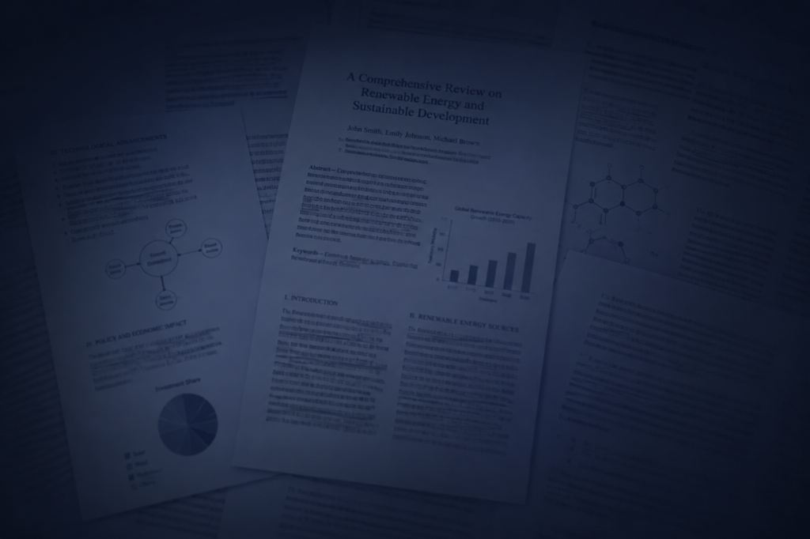
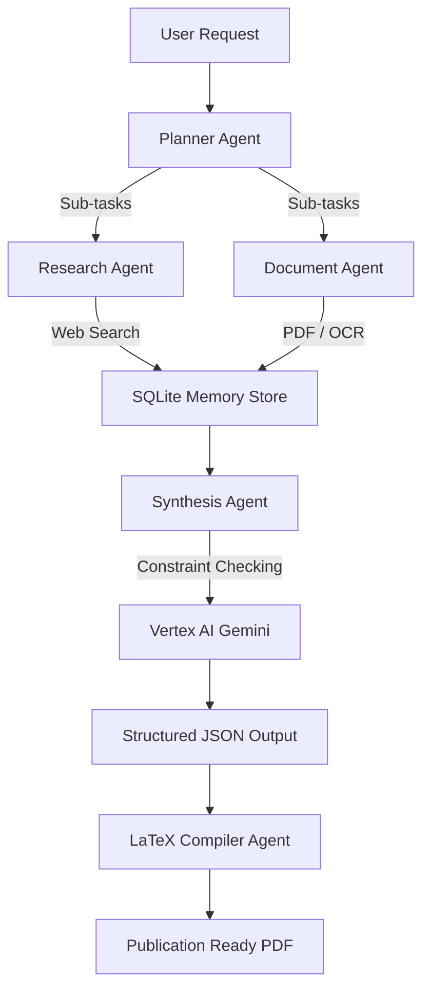
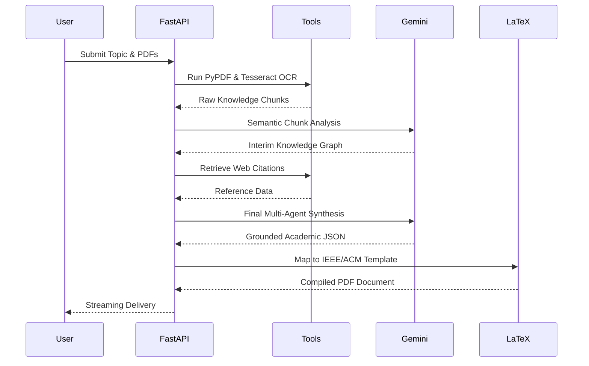
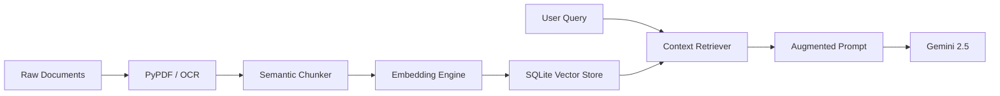
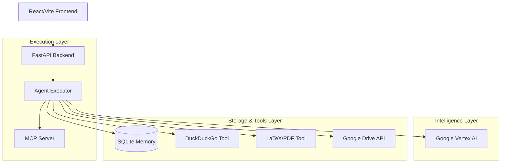

<p align="center">
  
</p>

<h1 align="center">
⚡ Autonomous Research Agent
</h1>

<p align="center">
AI-powered multi-agent academic research platform for autonomous IEEE paper generation, semantic retrieval, PDF intelligence, and citation-aware reasoning.
</p>

<p align="center">
  
  
  
  
  
  
  
  
  
</p>

<p align="center">
  <a href="#-overview">Overview</a> •
  <a href="#-features">Features</a> •
  <a href="#%EF%B8%8F-system-architecture">Architecture</a> •
  <a href="#%E2%9A%99%EF%B8%8F-quick-start">Quick Start</a> •
  <a href="#-api-documentation">API</a>
</p>

---

## 🚀 Overview

**Autonomous Research Agent** is a production-grade, multi-agent AI platform built to revolutionize the academic and technical R&D lifecycle. It transcends simple RAG chatbots by acting as an autonomous execution engine that synthesizes complex ideas, retrieves evidence via DuckDuckGo and deep PDF parsing, manages persistent memory, and automatically generates high-fidelity, citation-grounded research papers formatted strictly in IEEE, APA, or ACM templates.

Powered by Google's **Vertex AI (Gemini 2.5 Flash)** and orchestrated via a high-performance **FastAPI** backend, the agent executes tasks across a decentralized workflow before delivering results to a cinematic **React/Vite** dashboard.

---

## ✨ Features

<div align="center">
  <table>
    <tr>
      <td><b>🤖 Multi-Agent Engine</b><br/>Decentralized execution using Planner, Research, and Synthesis agents.</td>
      <td><b>📚 PDF Intelligence</b><br/>Deep extraction using PyPDF and OCR with Tesseract for image-heavy documents.</td>
    </tr>
    <tr>
      <td><b>🔍 Dynamic RAG & Search</b><br/>Live web citation discovery combined with SQLite-backed memory stores.</td>
      <td><b>📝 LaTeX Compilation</b><br/>Automated IEEE, APA, and ACM paper generation directly to PDF.</td>
    </tr>
    <tr>
      <td><b>⚙️ Model Context Protocol</b><br/>MCP integration allowing dynamic runtime tool discovery and scaling.</td>
      <td><b>☁️ Automated Export</b><br/>Direct integrations with Google Drive for seamless deliverable handoffs.</td>
    </tr>
    <tr>
      <td><b>💻 Cinematic Dashboard</b><br/>Dark-mode native, Framer Motion-powered React UI with live markdown streaming.</td>
      <td><b>🔒 Enterprise Security</b><br/>Robust exception handling, isolated execution paths, and secret management.</td>
    </tr>
  </table>
</div>

---

## 📸 Dashboard Preview

<p align="center">
  
</p>

---

## 🤖 AI Agents

The core intelligence is distributed across specialized agentic personas:

- **Planner Agent**: Analyzes user prompts and decomposes them into executable deterministic steps.
- **Research Agent**: Scours the web (DuckDuckGo) and local vector stores for highly relevant citations and contextual grounding.
- **Document Agent**: Parses uploaded PDFs and uses OCR on images, segmenting text into dense knowledge chunks.
- **Synthesis Agent**: Merges instructions, templates, and raw data into heavily structured, citation-aware JSON responses.
- **Compiler Agent**: Intercepts LLM outputs and securely bridges them into a LaTeX engine for rendering.

---

## 🧠 Multi-Agent Workflow



---

## 📄 Research Pipeline


## 🔍 RAG Architecture

Our advanced Retrieval-Augmented Generation (RAG) architecture ensures zero hallucination by anchoring generation strictly to extracted knowledge.



---

## 📚 Citation Intelligence

Citations are heavily managed to avoid JSON schema breakage. External sources and parsed document chunks are dynamically injected into a secondary citation resolution prompt. 
- Auto-deduplication of references.
- Dynamic cross-referencing mapping `[1]`, `[2]` into the actual paragraph bodies.

---

## 🏗️ System Architecture



---

## 📂 Project Structure

```bash
autonomous-research-agent/
├── backend/                  # High-performance API and Agent Core
│   ├── agent/                # Executor, memory, and planner modules
│   ├── mcp/                  # Model Context Protocol integration
│   ├── paper_templates/      # Raw .tex templates (IEEE, APA, ACM)
│   ├── routes/               # FastAPI endpoints
│   ├── tools/                # Discovery tools (Search, PDF, OCR)
│   └── pdf_generator.py      # LaTeX Compilation bridge
├── frontend/                 # Cinematic UI Application
│   ├── src/
│   │   ├── components/       # Shadcn UI primitives
│   │   ├── hooks/            # State and API hooks
│   │   └── pages/            # Primary Dashboard views
│   └── tailwind.config.ts    # Design tokens
├── docs/                     # Assets, screenshots, and architecture
├── start.sh                  # Application orchestrator
└── .env.example              # Configuration template
```

---

## ⚙️ Quick Start

### Prerequisites
- Node.js 18+
- Python 3.10+
- LaTeX (`texlive-full` or MacTeX)
- Tesseract OCR

### Installation

```bash
# 1. Clone the repository
git clone https://github.com/virubot/Autonomous-Research-Agent.git
cd Autonomous-Research-Agent

# 2. Configure Environment
cp .env.example .env

# 3. Setup Python Backend
python -m venv .venv
source .venv/bin/activate
pip install -r requirements.txt

# 4. Setup React Frontend
cd frontend
npm install
cd ..

# 5. Boot the Platform
./start.sh
```

---

## 🔑 Environment Variables

| Variable | Description | Requirement |
|----------|-------------|-------------|
| `GOOGLE_CLOUD_PROJECT` | GCP Project ID for Vertex AI | **Required** |
| `GOOGLE_CLOUD_LOCATION` | Region (e.g., `us-central1`) | **Required** |
| `GOOGLE_APPLICATION_CREDENTIALS` | Absolute path to Service Account JSON | **Required** |
| `GEMINI_MODEL` | LLM version (e.g. `gemini-2.5-flash`) | Optional |
| `MCP_ENABLED` | Enable Model Context Protocol | Optional |

---

## 📊 API Documentation

| Endpoint | Method | Description |
|----------|--------|-------------|
| `/` | `GET` | Serves the cinematic React/Vite dashboard application |
| `/health` | `GET` | System health check and Vertex AI / Drive diagnostic info |
| `/generate` | `POST` | Core execution endpoint for paper generation |
| `/upload` | `POST` | Ingestion pipeline for PDF and image OCR intelligence |
| `/history` | `GET` | Retrieves the history of generated papers |
| `/mcp/health` | `GET` | Diagnostic status of the MCP server |

---

## 🎨 Frontend/UI

Built for researchers and developers alike, the interface embodies a premium aesthetic:
- **Shadcn UI & Tailwind CSS**: Pixel-perfect component styling.
- **Framer Motion**: Micro-interactions bridging user actions with agent states.
- **Live Markdown**: Streaming SSE support dynamically renders Mermaid charts and rich text.

---

## 🔒 Security

- **Sandboxed Compilation**: The LaTeX subprocess executes in isolated temporal directories with hard kill limits.
- **Exception Sanitization**: Global handlers intercept internal tracebacks, preventing AI pipeline logic leakage.
- **Secure File Ingestion**: File-type constraints and payload size limits on all `upload` endpoints.

---

## 🚀 Deployment

### Docker (Backend)
Containerize the FastAPI instance ensuring dependencies for LaTeX and Tesseract are installed via `apt-get`.
```dockerfile
RUN apt-get update && apt-get install -y texlive-full tesseract-ocr
```

### Vercel (Frontend)
The Vite frontend compiles smoothly into static assets for Vercel. Set your upstream API origin in your Vercel production settings.

---

## 📈 Benchmarks

| Operation | Latency | Target Throughput |
|-----------|---------|-------------------|
| Agent Orchestration | `~1.2s` | High |
| Document Extraction | `~4s / doc` | High |
| Web Scraping | `~2s / query` | Medium |
| LaTeX PDF Compile | `< 4s` | Sub-process bound |

---

## 🧪 Examples

<details>
<summary><b>API POST Example</b></summary>

```bash
curl -X POST http://localhost:8000/generate \
-H "Content-Type: application/json" \
-d '{
  "prompt": "The integration of multi-agent architectures in academic writing",
  "format_type": "ieee",
  "page_length": "4-5"
}'
```
</details>

---

## 🗺️ Roadmap

- [x] Multi-agent orchestration layer
- [x] RAG with SQLite persistence
- [x] LaTeX IEEE/APA/ACM generation
- [x] Model Context Protocol Integration
- [ ] Direct ArXiv API connections
- [ ] Enterprise Auth (OAuth 2.0 / RBAC)
- [ ] Automated Peer-Review Agent persona

---

## 🤝 Contributing

Contributions make the open source community such an amazing place to learn, inspire, and create. Any contributions you make are **greatly appreciated**.

1. Fork the Project
2. Create your Feature Branch (`git checkout -b feature/AmazingFeature`)
3. Commit your Changes (`git commit -m 'Add some AmazingFeature'`)
4. Push to the Branch (`git push origin feature/AmazingFeature`)
5. Open a Pull Request

---

## 📜 License

Distributed under the MIT License. See `LICENSE` for more information.

---

<p align="center">
  
</p>
