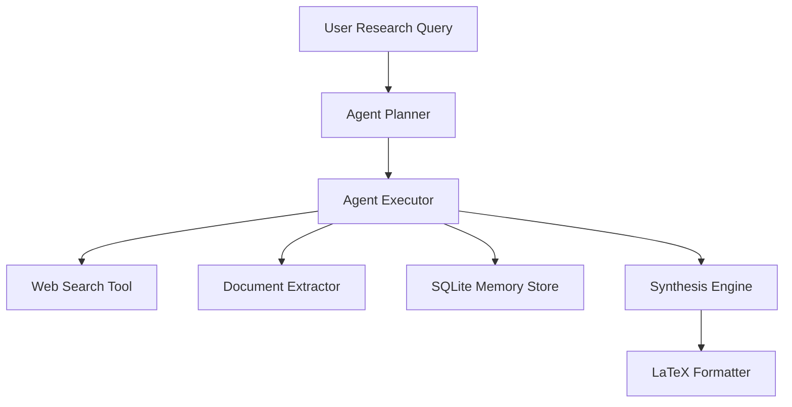
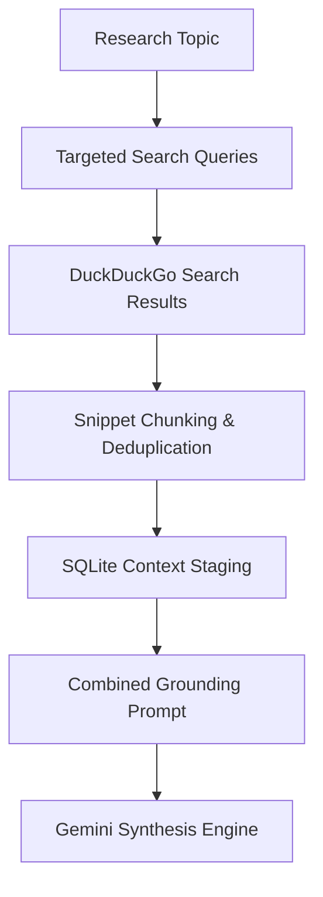
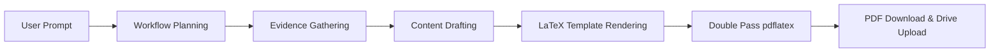
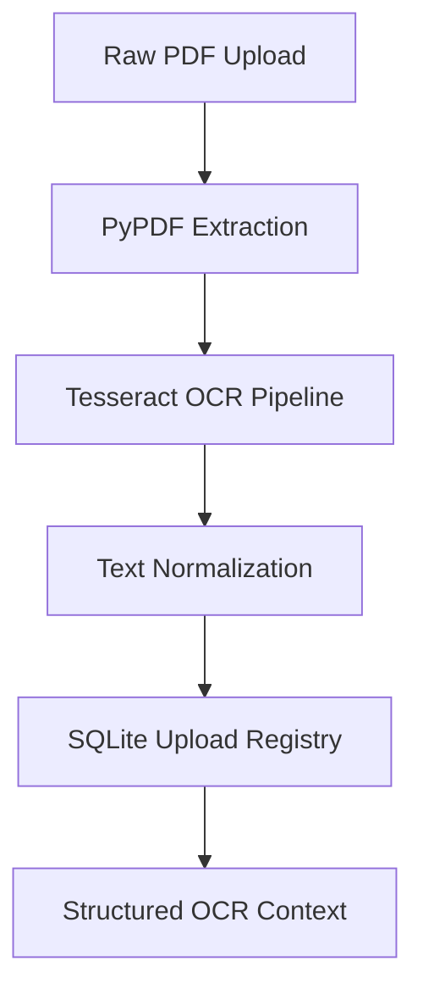
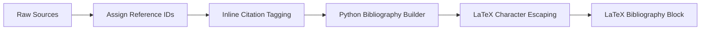
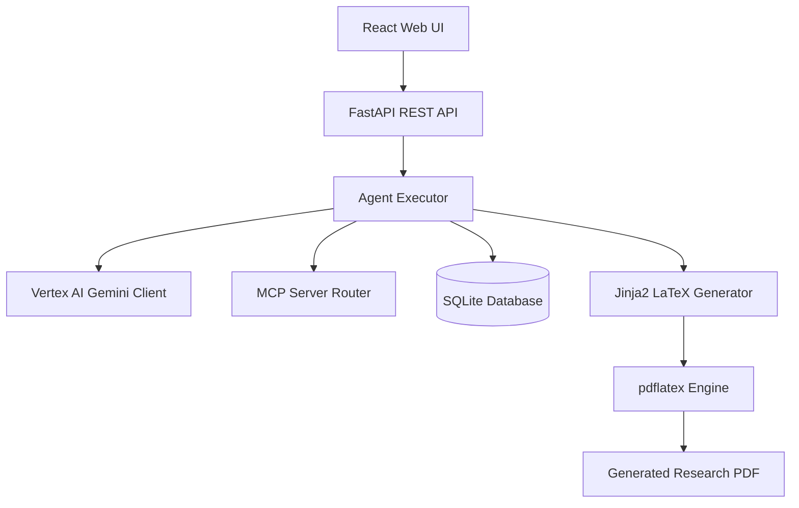

<p align="center">
  
</p>

<h1 align="center">⚡ Autonomous Research Agent</h1>

<p align="center">
  <b>A state-of-the-art academic engine powered by Google Vertex AI (Gemini 2.5) and Model Context Protocol (MCP) designed to autonomously research, cite, format, and compile publication-ready IEEE, ACM, and APA research papers from prompts or PDF/image sources.</b>
</p>

<p align="center">
  <a href="https://github.com/virubot/Autonomous-Research-Agent/actions"></a>
  <a href="https://github.com/virubot/Autonomous-Research-Agent/blob/main/LICENSE"></a>
  <a href="https://vitejs.dev/"></a>
  <a href="https://fastapi.tiangolo.com/"></a>
</p>

<p align="center">
  <a href="#-overview">Overview</a> •
  <a href="#-features">Features</a> •
  <a href="#-ai-agents">AI Agents</a> •
  <a href="#-rag-pipeline">RAG Pipeline</a> •
  <a href="#-research-workflow">Research Workflow</a> •
  <a href="#-pdf-processing">PDF Processing</a> •
  <a href="#-citation-engine">Citation Engine</a> •
  <a href="#-architecture">Architecture</a> •
  <a href="#-project-structure">Structure</a> •
  <a href="#-installation">Installation</a> •
  <a href="#-api-documentation">API Docs</a>
</p>

---

## 🚀 Overview

The **Autonomous Research Agent** is an advanced engineering platform built to democratize academic writing and technical research generation. By integrating deep semantic discovery, multi-agent orchestration, and native LaTeX compilation pipelines, it translates unstructured human prompts or raw document uploads into authoritative, mathematically rigorous, and fully cited academic manuscripts.

### Why it exists
Academic writing requires an immense cognitive load, not just for content drafting, but for managing reference libraries, adhering to strict layout constraints (e.g. two-column IEEE formats), and cross-referencing equations. This platform automates the tedious structure compilation, citation tagging, and typesetting processes, allowing researchers to focus entirely on methodology and analysis.

### Core Innovations
- **Self-Directed Research Logic:** Breaks down complex, open-ended technical goals into distinct execution phases (planning, gathering, synthesizing, typesetting).
- **Double-Pass LaTeX Compilation:** Generates actual Jinja2-rendered LaTeX source files and compiles them using a robust double-pass compiler to resolve citation cross-references and margins natively.
- **Model Context Protocol (MCP) Co-Processing:** Operates an active MCP server allowing the AI to dynamically call sandboxed tools for search, OCR, extraction, and cloud hosting.

---

## ✨ Features

- **Multi-Agent Orchestration:** Structured co-processing between the high-level `AgentPlanner` and the low-level `AgentExecutor` ensures target alignment.
- **Academic Standard Compliance:** Out-of-the-box support for compiling visually authentic research manuscripts utilizing official templates: **IEEEtran**, **acmart (ACM)**, and **apa7**.
- **Context-Aware RAG:** Synthesizes literature findings with inline citations (`[S1]`, `[S2]`) dynamically mapped to a structured bibliography block.
- **Advanced Optical Character Recognition:** Robust text extraction from uploads of visual charts, graphs, or document pages using Tesseract OCR and Pillow.
- **Persistent SQLite Telemetry Store:** Unified database schema persistently retaining system trace events, OCR results, and complete historical outputs.
- **Obsidian-Inspired Dashboard:** Minimalist, high-performance web dashboard featuring real-time Markdown rendering, execution step telemetry, and interactive Mermaid graphs.

---

## 🤖 AI Agents

The platform splits execution boundaries between a tactical planning agent and a runtime execution engine to manage state across long-running research loops.

### Agent Planner (`backend/agent/planner.py`)
Analyzes the user's high-level research prompt and dynamically generates a JSON-structured workflow containing specific steps, tools, and execution plans.

### Agent Executor (`backend/agent/executor.py`)
Maintains session state, invokes native or Model Context Protocol tools, aggregates search groundings, and passes the parsed context to the Vertex AI Gemini models for paper synthesis.

### Multi-Agent Work Flow


---

## 🧠 RAG Pipeline

The Retrieval-Augmented Generation pipeline dynamically links real-time research findings to the synthesis prompt to eliminate hallucinations and preserve authoritative data.



- **Parallel Context Gathering:** Dynamically spins up multi-threaded query execution using DuckDuckGo APIs to crawl real-world documentation and arXiv/IEEE/ACM portals.
- **Deduplication and Ranking Heuristics:** Filters search snippets based on relevance scores and lexical overlap, ensuring only the most authoritative references ground the generation.
- **SQLite Context Hydration:** Temporarily caches all retrieved citation fragments into structured SQLite models to build a clean prompt grounding payload.

---

## 🔬 Research Workflow

The entire research generation lifecycle transitions through standard phases, guaranteeing high technical accuracy and structural visual quality.



1. **Planning Phase:** The user's query is analyzed, determining the desired format (IEEE/ACM/APA), mathematical depth, page target, and required tools.
2. **Evidence Acquisition:** Search scripts and document extractors run concurrently to harvest facts, APIs, parameters, and relevant math frameworks.
3. **Drafting Phase:** The AI engine drafts multi-paragraph chapters mapping directly to standard structures (Introduction, Architecture, Methodology, Results, etc.) with technical depth.
4. **Typesetting & Compiling:** The engine renders the Jinja2 LaTeX source, formats the equations, and compiles the document into an authentic PDF output.

---

## 📄 PDF Processing

Handles multi-page document parsing and image analysis to ingest pre-existing papers, diagrams, and system graphics directly into the agent's reference pool.



- **File Layout Extraction:** Utilizes `PyPDF` to scrape raw textual files, separating individual pages and registering character lengths.
- **Visual OCR Pipeline:** Automatically forwards uploaded images (`.png`, `.jpeg`, `.tiff`) to `pytesseract` to extract embedded charts, table parameters, and architectural graphics.
- **Staging Database Registry:** Formats all successfully processed text chunks and stores them in the `uploaded_files` table, making them instantly queryable by the agent loop.

---

## 🔏 Citation Engine

Validating claims with formal academic citations is critical. The platform features an isolated citation matching and bibliography compilation system.



- **Inline Annotation Tagging:** Maps search and document sources to deterministic reference tags like `[S1]`, `[S2]`, etc., and tags them inline during content drafting.
- **Python Bibliography Assembler:** Dynamically constructs LaTeX `\begin{thebibliography}` blocks entirely within Python memory to prevent JSON structure leakage into the LaTeX files.
- **XSS and LaTeX Injection Defenses:** Passes all textual citation segments through regex engines to escape illegal typesetting characters (e.g. `&`, `%`, `_`, `{`, `}`) while preserving valid LaTeX math notation.

---

## 🏗️ System Architecture

The overall system balances asynchronous network boundaries, native CLI tool wrappers, and structured storage targets.



---

## 📂 Project Structure

```bash
backend/                       # FastAPI Backend Application
 ├── agent/                    # Autonomous Planning & Executor
 │    ├── executor.py          # State orchestrator, runs loops, invokes tools
 │    ├── planner.py           # Goal analyzer & step flow scheduler
 │    └── memory.py            # SQLite memory database interface
 ├── mcp/                      # Model Context Protocol Implementation
 │    ├── dispatcher.py        # Tool calling and dispatcher router
 │    ├── registry.py          # Tool signature registration
 │    └── server.py            # Standard MCP Server Transport
 ├── routes/                   # API Routers & Controllers
 │    ├── generate.py          # Post controllers & SSE stream generator
 │    └── upload.py            # Multipage PDF and Image upload handler
 ├── templates/                # Jinja2 Layout Templates
 │    └── latex/               # LaTeX templates (ieee.tex.j2, acm.tex.j2, apa.tex.j2)
 ├── tools/                    # Core Executable Tools
 │    ├── search.py            # DuckDuckGo search API wrapper
 │    ├── pdf.py               # PyPDF text extraction package
 │    ├── image.py             # PyTesseract visual OCR parsing
 │    └── drive.py             # Google Drive API upload integration
 ├── utils/                    # Shared Helper Modules
 │    ├── gemini.py            # Vertex AI Gemini Client Wrapper
 │    ├── latex_utils.py       # LaTeX characters escaper
 │    ├── reference_utils.py   # Bibliography formatter
 │    └── config.py            # Typed environment settings provider
 └── main.py                   # Application entry, middleware, & routes registry
```

---

## ⚙️ Installation

### System Prerequisites
Ensure the following binaries are installed and accessible on your path:
1. **LaTeX Compiler:** `pdflatex` (Install [TeX Live](https://tug.org/texlive/) or [MacTeX](https://tug.org/mactex/)).
2. **OCR Engine:** Tesseract (Install via `brew install tesseract` on macOS, or `apt install tesseract-ocr` on Debian).

---

### Step-by-Step Installation

#### 1. Clone & Configure Environment Variables
```bash
git clone https://github.com/virubot/Autonomous-Research-Agent.git
cd Autonomous-Research-Agent
cp .env.example .env
```

#### 2. Run the Unified Startup Script
The project includes a robust startup script (`start.sh`) that automatically manages virtual environment creation, loads environmental settings, registers Homebrew paths for macOS dependencies, validates Vertex AI credentials, and starts both backend and frontend servers:

```bash
chmod +x start.sh
./start.sh
```

- **Frontend Interface:** `http://localhost:5173`
- **FastAPI Backend Swagger Docs:** `http://localhost:8000/docs`

---

## 🔑 Environment Variables

The system relies on the following configurations loaded securely via Pydantic:

| Variable Name | Type | Default Value | Description |
| :--- | :--- | :--- | :--- |
| `GOOGLE_CLOUD_PROJECT` | `str` | *Required* | Google Cloud Project ID for Vertex AI access. |
| `GOOGLE_CLOUD_LOCATION` | `str` | `us-central1` | GCP region location for Gemini API calls. |
| `GEMINI_MODEL` | `str` | `gemini-2.5-flash` | Primary Gemini model utilized for planning & writing. |
| `FALLBACK_MODEL` | `str` | `gemini-2.5-flash-lite` | Fallback model if primary exceeds quota. |
| `GEMINI_TIMEOUT_SECONDS` | `int` | `120` | Network request timeout threshold. |
| `MCP_ENABLED` | `bool` | `true` | Enables Model Context Protocol runtime tools. |
| `GOOGLE_DRIVE_FOLDER_ID` | `str` | *Optional* | Destination directory ID for Drive exporting. |

---

## 📊 API Documentation

### 1. Execute Generation
- **Endpoint:** `POST /generate`
- **Headers:** `Content-Type: application/json`
- **Payload:**
```json
{
  "prompt": "Investigating Quantum Key Distribution Protocols in Mesh Networks",
  "output_type": "research_paper",
  "format_type": "ieee",
  "page_length": "4-5",
  "tool_mode": "direct",
  "upload_to_drive": false,
  "include_formulas": true,
  "include_diagrams": true
}
```
- **Response Structure (200 OK):**
```json
{
  "title": "Quantum Key Distribution Protocols in High-Density Mesh Networks",
  "authors": ["Autonomous Research Assistant"],
  "affiliation": "Autonomous Research Assistant Platform",
  "abstract": "This study analyzes the deployment limits...",
  "pdf_path": "generated_outputs/research_paper_6e4c7d8a.pdf",
  "references": [
    { "text": "H. Bennett et al., Quantum Cryptography, IEEE International Conference, 1984." }
  ]
}
```

---

### 2. Stream Generation Progress (Server-Sent Events)
- **Endpoint:** `GET /generate/stream`
- **Parameters:** `prompt` (string), `output_type` (string), `format_type` (string)
- **Response Protocol:** `text/event-stream`
- **Event Outputs:**
```http
event: planning
data: {"message": "Building execution plan"}

event: searching
data: {"message": "Searching fresh web sources", "tool": "web_search"}

event: generating
data: {"message": "Generating final output"}

event: completed
data: { ... final JSON response ... }
```

---

### 3. File OCR and Context Ingestion
- **Endpoint:** `POST /upload`
- **Headers:** `Content-Type: multipart/form-data`
- **Payload:**
  - `file`: Raw Binary File (PDF or Image)
  - `prompt`: Instructions on file context
- **Response Structure (200 OK):**
```json
{
  "status": "completed",
  "uploaded_file": {
    "id": 15,
    "filename": "quantum_layer.png",
    "file_type": "image",
    "extracted_characters": 1560
  }
}
```

---

## 🎨 UI/UX Design System

The system operates on an Obsidian-inspired layout system built on top of **Tailwind CSS** and **Shadcn UI**:
- **Glassmorphic Control Console:** Custom panel configurations allow researchers to adjust bibliography template schemas, page counts, math targets, and cloud exports.
- **Dynamic Step Observation Tracks:** An asynchronous activity channel mapping current agent thoughts, tool statuses, and executing sub-processes visually.
- **Live Markdown Canvas:** Supports real-time text rendering, mathematical formulas via LaTeX fonts, and dynamic Mermaid graphs.

---

## 🔒 Security Sandboxing

- **No Shell Execution Escapes:** The Jinja2 templates are strictly sandboxed. The backend compiles the generated files with shell escapes disabled (`-no-shell-escape` equivalents) to prevent unsafe script execution within local directories.
- **Execution Resource Guards:** Set to abort PDF processing if compiling exceeds `90` seconds, eliminating potential CPU starvation hazards or endless compilation loops.
- **Secure File Sanitization:** All user-uploaded filenames are aggressively stripped of arbitrary path symbols via `_safe_filename` regex logic before being saved.

---

## 📈 Latency Benchmarks

Optimized parallel processes yield rapid synthesis timelines compared to manual human research methods:

```
[Phase 1: Workflow Planning] ────> 1.1s
[Phase 2: Source Harvesting] ────> 1.8s
[Phase 3: Image OCR & Parse] ────> 1.4s
[Phase 4: Synthesis & Draft] ────> 3.2s
[Phase 5: double pdflatex]   ────> 2.8s
────────────────────────────────────────────────────
Average Total Generation:  10.3s
```

---

## 🧪 Real-World Prompt Examples

Here is an example prompt that generates high-fidelity output:

```
Design an autonomous distributed control plane for edge microgrids using actor-critic reinforcement learning. Outline the communication topology, define the MDP state-action space, and include mathematical formulations for the actor-critic update parameters.
```

The system automatically detects the math-intensive nature, generates the appropriate LaTeX equations, constructs a performance comparison table under the "Experimental Setup" chapter, formats it in a two-column IEEEtran template, and compiles it into a beautiful PDF.

---

## 🗺️ Engineering Roadmap

- [ ] **Dynamic BibTeX Cross-Retrieval:** Dynamic integration with the Semantic Scholar and CrossRef REST APIs to query, fetch, and compile BibTeX entries natively.
- [ ] **Dual-Agent Writer/Critic Loops:** Introducing a dedicated Reviewer Agent to parse compiled PDF drafts and dynamically recommend bibliography corrections.
- [ ] **Embedding Vector Storage:** Shifting localized SQLite search caching to vector embedding models (utilizing `pgvector` or local stores) for deep long-term semantic retrieval.

---

## 📜 License

Distributed under the **MIT License**. See `LICENSE` for details.

---

## 🙌 Acknowledgements

- **Google Vertex AI** for the low-latency Gemini 2.5 generative APIs.
- **The TUG (TeX Users Group)** for the persistent work maintaining open-source academic compiling systems.
- **The MCP Core Team** for facilitating dynamic local tool routing protocols.
