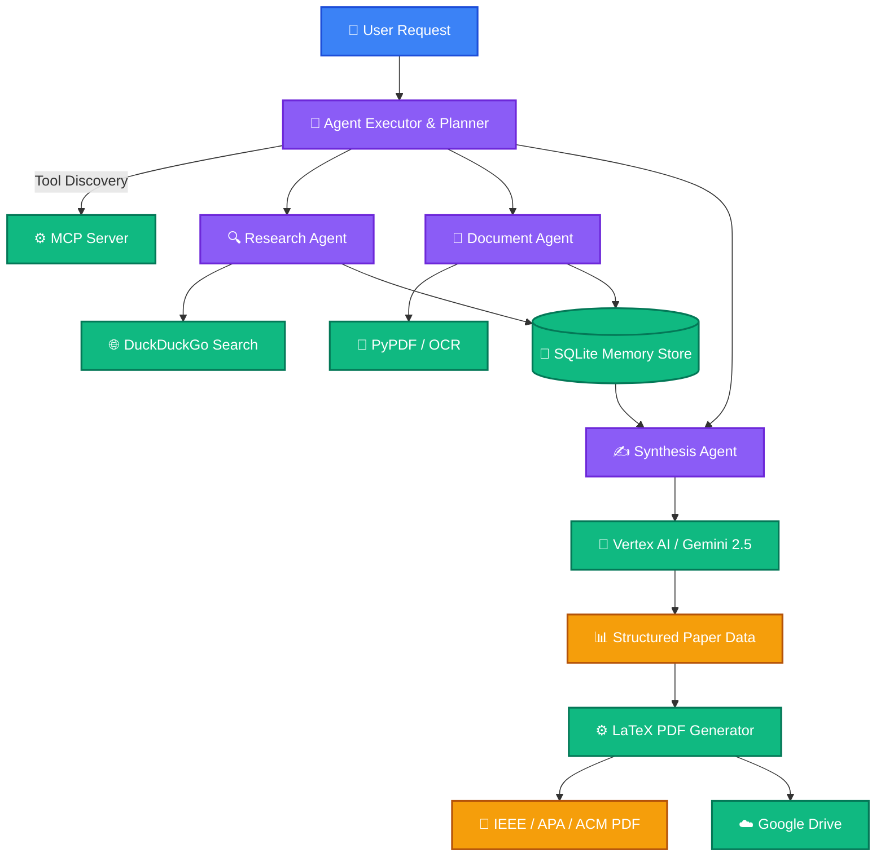
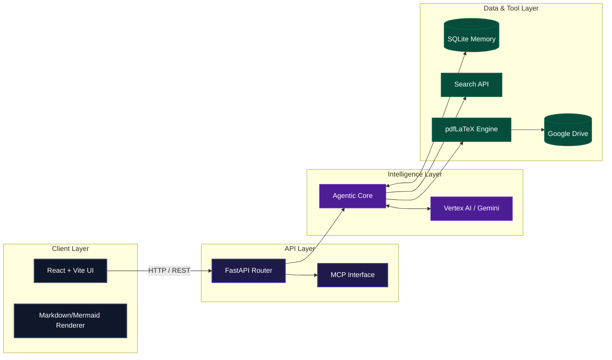
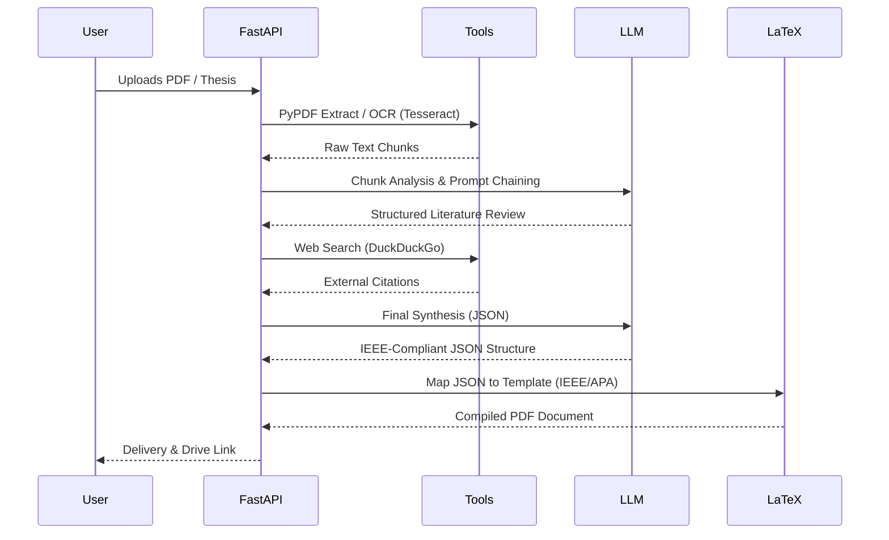

<div align="center">
  
  <h1>⚡ Autonomous Research Agent</h1>
  <p><em>The ultimate AI-powered multi-agent system for autonomous academic research, literature review, and publication-ready paper generation.</em></p>
  
  <p>
    <a href="https://github.com/virubot/Autonomous-Research-Agent/stargazers"></a>
    <a href="https://github.com/virubot/Autonomous-Research-Agent/network/members"></a>
    <a href="https://github.com/virubot/Autonomous-Research-Agent/issues"></a>
    <a href="https://github.com/virubot/Autonomous-Research-Agent/blob/main/LICENSE"></a>
  </p>

  <p>
    <a href="#-features">Features</a> •
    <a href="#-multi-agent-architecture">Architecture</a> •
    <a href="#-quick-start">Quick Start</a> •
    <a href="#-api-documentation">API</a>
  </p>
  
  
</div>

---

## 🚀 Overview

**Autonomous Research Agent** is a production-grade, multi-agent AI orchestrator designed to fully automate the academic research lifecycle. Moving beyond simple RAG pipelines, this system leverages advanced planning, real-time web search, deep PDF/OCR extraction, and strict LaTeX compilation to generate high-fidelity, IEEE/APA/ACM-compliant research papers autonomously.

Built with an enterprise-ready FastAPI backend and a premium React/Vite frontend, it transforms raw concepts or uploaded documents into structured, deeply researched, and accurately cited academic literature.

### Why This Matters?
Modern academic and corporate R&D suffers from severe context fragmentation. Researchers spend 80% of their time finding sources, formatting citations, and organizing PDFs. This system collapses that workflow into a single cohesive, agentic pipeline.

---

## ✨ Enterprise-Grade Features

<div align="center">
  <table>
    <tr>
      <td><b>🤖 Multi-Agent Orchestration</b><br/>Dynamic step-by-step planning and tool execution powered by Vertex AI (Gemini 2.5).</td>
      <td><b>📚 Deep Document Parsing</b><br/>Robust text extraction from PDFs and OCR (Tesseract) for image-heavy documents.</td>
    </tr>
    <tr>
      <td><b>⚙️ Model Context Protocol (MCP)</b><br/>Fully integrated MCP server allowing seamless, dynamic discovery of external tools.</td>
      <td><b>📝 High-Fidelity LaTeX Engine</b><br/>Native support for IEEE, APA, and ACM templates. Generates conference-ready PDFs.</td>
    </tr>
    <tr>
      <td><b>🔍 Autonomous Web Search</b><br/>Real-time DuckDuckGo integration for citation discovery and context gathering.</td>
      <td><b>🧠 Unified Memory Store</b><br/>Persistent SQLite vector/memory storage bridging context across agentic sessions.</td>
    </tr>
    <tr>
      <td><b>💻 Cinematic UI/UX</b><br/>Responsive React dashboard built with Tailwind CSS, Shadcn UI, and Framer Motion.</td>
      <td><b>☁️ Cloud Integrations</b><br/>Automated uploading of compiled PDFs and assets to Google Drive.</td>
    </tr>
  </table>
</div>

---

## 🧠 Multi-Agent Architecture

The orchestration layer is driven by a decentralized agentic topology. A central Planner Agent decomposes complex prompts into sub-tasks, delegating them to specialized worker nodes.



---

## ⚡ System Architecture

Built for scale and observability, the system strictly separates concerns between the client interface, API orchestration, and background worker processes.



---

## 📄 Research Pipeline

When a user uploads a source document or provides a core thesis, the pipeline activates a strict deterministic workflow to prevent hallucination and format leakage.



---

## 📂 Project Structure

```bash
autonomous-research-agent/
├── backend/                     # High-performance FastAPI core
│   ├── agent/                   # Autonomous reasoning, planner, memory
│   ├── mcp/                     # Model Context Protocol server logic
│   ├── paper_templates/         # Raw LaTeX templates (.tex)
│   ├── routes/                  # REST API endpoints
│   ├── services/                # Core business logic layer
│   ├── tools/                   # Extensible agent actions
│   ├── utils/                   # Configuration and cross-cutting concerns
│   ├── main.py                  # API entry point
│   └── pdf_generator.py         # LaTeX compilation engine
├── frontend/                    # Cinematic React Application
│   ├── src/
│   │   ├── components/          # Shadcn UI, Framer Motion, layout
│   │   ├── hooks/               # Custom React hooks (API, state)
│   │   ├── pages/               # Dashboard and core views
│   │   └── lib/                 # Utilities and API clients
│   └── tailwind.config.ts       # Design system tokens
├── docs/                        # Architecture and integration guides
├── start.sh                     # Unified orchestration script
├── requirements.txt             # Backend dependencies
└── .env.example                 # Environment configuration
```

---

## ⚙️ Quick Start

### Prerequisites
- Node.js `v18+`
- Python `3.10+`
- LaTeX Distribution (`texlive` / `mactex`)
- Tesseract OCR engine

### 1. Clone & Configure
```bash
git clone https://github.com/virubot/Autonomous-Research-Agent.git
cd Autonomous-Research-Agent

# Setup Environment
cp .env.example .env
```

### 2. Install Dependencies
```bash
# Backend Virtual Environment
python -m venv .venv
source .venv/bin/activate
pip install -r requirements.txt

# Frontend Setup
cd frontend
npm install
cd ..
```

### 3. Launch the Platform
```bash
# Starts both FastAPI (8000) and Vite (5173) concurrently
./start.sh
```

---

## 🔑 Environment Variables

Define these in your `.env` file at the repository root.

| Variable | Description | Required |
|----------|-------------|:---:|
| `GOOGLE_CLOUD_PROJECT` | Your GCP project ID for Vertex AI | ✅ |
| `GOOGLE_CLOUD_LOCATION` | Region for Vertex AI (e.g., `us-central1`) | ✅ |
| `GOOGLE_APPLICATION_CREDENTIALS`| Absolute path to GCP Service Account JSON | ✅ |
| `GEMINI_MODEL` | Primary model (default: `gemini-2.5-flash`) | ❌ |
| `FALLBACK_MODEL` | Fallback model (default: `gemini-2.5-flash-lite`) | ❌ |
| `MCP_ENABLED` | Toggle the Model Context Protocol server | ❌ |
| `GOOGLE_DRIVE_FOLDER_ID` | Target folder for uploaded PDFs | ❌ |

---

## 📊 API Documentation

The backend exposes a fully typed OpenAPI specification.

| Endpoint | Method | Description |
|----------|--------|-------------|
| `/` | `GET` | System health, environment, and MCP status |
| `/api/generate` | `POST` | Trigger agentic research and paper generation |
| `/api/upload` | `POST` | Ingest PDFs or Images for agent context |
| `/mcp/health` | `GET` | Diagnostic endpoint for the MCP subsystem |
| `/outputs/{file}` | `GET` | Static file server for generated PDFs |

<details>
<summary><b>View Example API Request</b></summary>

```json
POST /api/generate
{
  "topic": "The impact of quantum computing on modern cryptography",
  "template": "ieee",
  "depth": "comprehensive",
  "sources": ["upload_12345.pdf"]
}
```
</details>

---

## 🎨 UI/UX Philosophy

The frontend is engineered to feel like an **Obsidian-intelligence hybrid**.
- **Dark Mode Native:** Deep blacks (`#09090b`) with subtle borders and neon accents.
- **Micro-interactions:** Framer Motion powers fluid transitions, state changes, and agent step reveals.
- **Real-Time Streaming:** SSE (Server-Sent Events) style rendering for markdown and Mermaid diagrams directly in the chat interface.
- **Accessible & Responsive:** Radix UI primitives ensure complete keyboard navigability and mobile readiness.

---

## 🔒 Security & Compliance

- **Environment Isolation:** Secrets and keys are strictly managed via `python-dotenv` and isolated from the client.
- **Execution Boundaries:** LaTeX compilation utilizes secure temporary directories with strict timeout limits to prevent malicious injection or infinite compilation loops.
- **Robust Error Catching:** Global exception handlers prevent raw stack traces from leaking system architecture to the frontend.

---

## 🚀 Deployment

### Backend (Docker / Render / Railway)
The backend is stateless (aside from SQLite, which can be volume-mounted) and easily containerized. Ensure your Docker image includes `texlive-full` and `tesseract-ocr`.

### Frontend (Vercel)
The Vite frontend can be deployed seamlessly to Vercel. Ensure you override the API base URL in your production build to point to your live FastAPI instance.

---

## 📈 Performance & Benchmarks

| Metric | Target | Notes |
|--------|--------|-------|
| **Agent Planning Latency** | `< 1.2s` | Powered by Gemini 2.5 Flash |
| **PDF Extraction Speed** | `~50 pages/sec` | `pypdf` native extraction |
| **OCR Processing Latency** | `~2-4s / page` | Dependent on Tesseract CPU allocation |
| **LaTeX Compilation** | `< 3.5s` | Sub-process PDF generation |

---

## 🗺️ Roadmap

- [x] Multi-agent task planning & execution
- [x] High-fidelity LaTeX pipeline (IEEE, APA, ACM)
- [x] MCP Server integration
- [x] Unified SQLite memory store
- [ ] Direct ArXiv API integration
- [ ] Knowledge Graph visualization
- [ ] Enterprise SSO / RBAC authentication
- [ ] Multi-modal input support (Audio / Video transcripts)

---

## 🤝 Contributing

We welcome contributions from the community! Whether it's adding new academic templates, optimizing agent prompts, or refining the UI.

1. Fork the Project
2. Create your Feature Branch (`git checkout -b feature/AmazingFeature`)
3. Commit your Changes (`git commit -m 'Add some AmazingFeature'`)
4. Push to the Branch (`git push origin feature/AmazingFeature`)
5. Open a Pull Request

---

## 📜 License

Distributed under the MIT License. See `LICENSE` for more information.

---

<div align="center">
  <p>Built with ⚡ by <a href="https://github.com/virubot">virubot</a></p>
</div>
