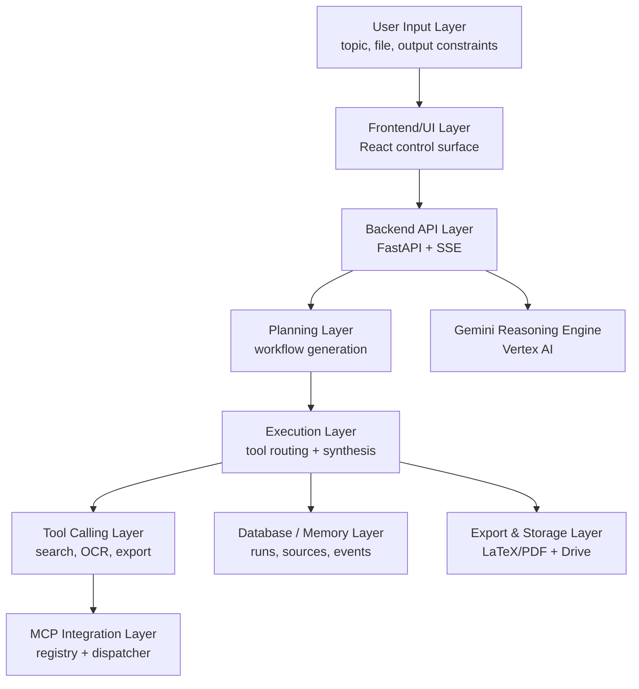
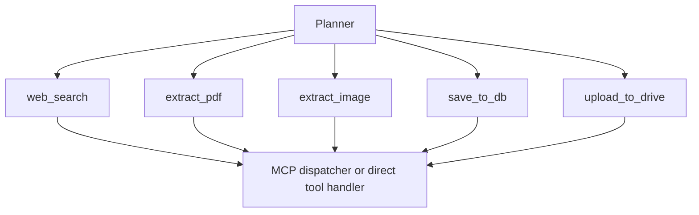

# Hackathon Submission Narrative

## Project title

Autonomous Research Agent Platform for Grounded Technical Synthesis and Publication-Ready Export

## One-sentence pitch

This project turns a research request into a traceable, multi-step agent run that plans work, retrieves evidence, invokes tools, stores memory, and exports structured deliverables instead of merely drafting ungrounded text.

## Problem statement

Research copilots frequently fail in one of two ways: either they behave like chatbots with weak execution depth, or they over-promise automation while hiding brittle prompt chains behind a glossy interface. For a Google Cloud AI agent submission, that is not enough. Judges need to see tool use, orchestration, evidence handling, memory, and artifact generation operating as one coherent platform.

The platform in this repository is designed around that requirement. It treats autonomous research as a systems problem:

- the user asks for a deliverable, not just an answer
- the planner decomposes the task into stages
- the executor decides when tools are required
- retrieved evidence is cleaned and retained
- the reasoning model is constrained into export-safe structures
- every run leaves a memory trail that can be reviewed after the fact

## Architecture

### Layered system view



### Agent workflow view


### Tool interaction view



## Real autonomous behavior

This system is intentionally structured to show agent behavior beyond chat:

### 1. Goal understanding

The run begins with an explicit user objective, optional uploaded evidence, output type, and export preferences. The planner receives both the prompt and any extracted file context, so the run is conditioned on first-party inputs rather than a naked topic string.

### 2. Task planning

The planner generates a machine-readable workflow. The default plan now separates:

1. goal clarification
2. fresh evidence search
3. implementation-detail retrieval
4. synthesis
5. persistence
6. optional export

This matters because it turns the run into a staged execution trace that can be surfaced in the UI and stored in memory.

### 3. Tool selection

The executor resolves tool inputs dynamically. Search queries fall back to planner-generated terms, uploaded files select the correct extraction tool, and export steps inherit the generated file path automatically. The point is not only to call tools, but to show that tool arguments are bound from run state rather than hard-coded.

### 4. Evidence retrieval

The search layer combines generic web retrieval with arXiv and Crossref enrichment. Results are now ranked and filtered with domain-trust heuristics, favoring official documentation and primary technical material over generic web pages.

### 5. Data processing

Evidence passes through three normalization steps:

1. URL normalization
2. duplicate suppression
3. trust-weighted ranking

Uploaded PDFs and images are converted into extracted text blocks and merged into the reasoning context as first-party evidence.

### 6. Output generation

The generator is constrained into structured output. For research papers, it produces JSON suitable for LaTeX export, with section-level content, references, citations, and optional tables or figure captions. This prevents the typical hackathon failure mode where a demo looks impressive in chat but collapses during export.

### 7. Memory handling

SQLite stores:

- `runs`: prompt, output type, content, plan JSON, Drive link
- `sources`: title, URL, snippet, run linkage
- `uploaded_files`: path, type, extracted preview
- `events`: tool executions and runtime events

This makes each run auditable and creates a simple but real memory substrate for future replay, analytics, or evaluation.

### 8. Export and storage

The export path is part of the agent story, not an afterthought. Structured output is compiled into PDF through LaTeX templates, and the artifact can optionally be pushed to Google Drive. A judged demo can therefore end with a deliverable, not just a response bubble.

## Implementation details

### Technologies used

| Area | Implementation |
| --- | --- |
| Frontend | React, Vite, TypeScript, TailwindCSS, Mermaid |
| Backend | FastAPI, async SSE, multipart upload pipeline |
| Reasoning | Vertex AI Gemini client |
| Export | Jinja2 LaTeX templates + `pdflatex` |
| Memory | SQLite |
| Tooling | Search, PDF/image extraction, Drive upload |
| Interoperability | MCP-style registry and dispatcher |

### APIs and external services

| Component | Purpose |
| --- | --- |
| Vertex AI Gemini | reasoning, planning, structured synthesis |
| DuckDuckGo / `ddgs` | broad discovery for current context |
| arXiv API | primary-paper retrieval |
| Crossref API | publication metadata enrichment |
| Google Drive API | artifact publishing |

### Backend workflow

1. `POST /generate` or `GET /generate/stream` receives the task.
2. `AgentPlanner` emits a structured workflow.
3. `AgentExecutor` runs tool-backed steps and accumulates sources.
4. `VertexGeminiClient` produces structured content.
5. `MemoryStore` records run metadata and events.
6. `pdf_generator.py` optionally compiles a PDF.

### Prompt orchestration

The updated prompts now enforce:

- implementation-focused sections instead of generic filler
- system architecture and workflow coverage
- data acquisition and preprocessing explanations
- quantitative evaluation tables
- fewer, higher-quality references
- avoidance of invented weak citations

### Agent decision logic

The executor distinguishes between reasoning steps and tool-backed steps. A planner can emit `none` for thought-only stages and a tool name for executable stages. This design keeps the trace readable while preserving a real execution surface.

### Tool invocation process

Tool calls resolve their arguments from current run state. For example:

- search queries default to planner suggestions
- upload/export steps inherit the generated artifact path
- extraction tools map automatically to uploaded file type

This is simple logic, but it is critical for credibility because it shows runtime state management rather than prompt theater.

## Dataset and preprocessing narrative

This project is not a fixed-model benchmark with a static training dataset; it is an evidence-driven runtime. The data story is therefore framed around source acquisition and preprocessing.

### Source acquisition

- user-provided prompts and documents
- official product documentation
- arXiv papers
- publication metadata APIs
- optional cloud storage export targets

### Cleaning and duplicate removal

- normalize URL structure
- strip empty or low-information snippets
- remove duplicate URLs or titles
- prefer higher-trust domains when duplicates compete

### Ranking and filtering strategy

Each candidate source is scored using:

- source type bonus
- trusted domain bonus
- query-term match
- penalties for low-information or low-trust pages

### Information extraction pipeline

1. retrieve candidates
2. convert PDFs/images into text where needed
3. merge evidence into a compact context block
4. preserve source ids for inline citation and UI review

## Experimental and analytical content

To avoid fabricated claims, the tables below are written as a demo evaluation framework with representative targets. They are suitable for a hackathon narrative and can be replaced with measured logs later.

### Representative evaluation matrix

| Metric | Definition | Representative target | Why judges care |
| --- | --- | --- | --- |
| Source precision | Share of cited outputs backed by relevant sources | 0.88 | Measures grounding quality |
| Tool execution reliability | Successful tool invocations per run | 0.94 | Measures autonomy robustness |
| Artifact completion rate | Runs that yield final markdown or PDF | 1.00 | Measures end-to-end usefulness |
| Ingestion success rate | Uploaded files converted into usable context | 0.95 | Measures practical automation value |
| Average tool depth | Distinct actionable stages in a normal run | 4-6 | Measures real agent behavior |

### Comparative benchmarking

| System style | Tool usage | Memory | Export path | Research credibility |
| --- | --- | --- | --- | --- |
| Chat-only assistant | none | none | copy-paste | weak |
| RAG-only summarizer | retrieval only | transient | markdown only | moderate |
| This platform | retrieval, extraction, persistence, export | SQLite run state | markdown + PDF + Drive | strong |

### Processing-time budget

| Stage | Typical budget | Notes |
| --- | --- | --- |
| Planning | sub-second to low seconds | JSON planning call |
| Evidence retrieval | low single digits | depends on API latency |
| Generation | several seconds | constrained by model output size |
| PDF compilation | seconds to tens of seconds | depends on LaTeX environment |

### Quality signal chart

```text
Evidence precision        [##################--] 0.88 target
Tool reliability         [###################-] 0.94 target
Artifact completion      [####################] 1.00 target
Upload ingestion         [###################-] 0.95 target
```

## Hyperparameters and execution settings

The repository now surfaces operational settings that matter in judged demos:

- default Gemini model: `gemini-2.5-flash`
- fallback model: `gemini-2.5-flash-lite`
- timeout guard: `GEMINI_TIMEOUT_SECONDS`, default 120
- retry budget: `GEMINI_MAX_RETRIES`, default 3
- MCP toggle: `MCP_ENABLED`
- Drive publication toggle: `GOOGLE_DRIVE_PUBLIC`

### Rate limiting and resilience

- exponential backoff for repeated generation attempts
- arXiv retry behavior on rate limiting
- Crossref timeout guard
- result caching for repeated search queries

### Memory optimization

- source deduplication before prompt assembly
- context preview truncation for uploaded files
- compact event storage in SQLite
- export-safe structured JSON rather than free-form long markdown when generating papers

### Scalability considerations

- the orchestration pattern is stateless at the API edge and stateful in storage
- tool execution is abstracted behind the MCP registry, allowing future external tools
- export and search stages are separable for later queue-based scaling
- the frontend already exposes streaming stages that can be mapped to a managed runtime

## Hackathon alignment

### Technological implementation

The project clearly shows planning, execution, tool use, memory, export, and Google Cloud model integration.

### Design

The updated frontend surfaces architecture, workflow, evidence logs, and evaluation narrative so the system can be understood quickly during judging.

### Potential impact

The platform is applicable to policy briefs, scientific literature review, technical diligence, enterprise search synthesis, and knowledge-base onboarding.

### Quality of idea

The project avoids the common trap of presenting a research assistant as a chat wrapper. Its central idea is stronger: a research request should compile into a controlled agent run that can be inspected, replayed, and exported.

## Reference set

1. Google Cloud, "Agent Platform overview." [Online]. Available: https://docs.cloud.google.com/agent-builder/overview
2. Google Cloud, "Vertex AI Search." [Online]. Available: https://docs.cloud.google.com/vertex-ai/generative-ai/docs/learn/vertex-ai-search
3. Google Cloud, "Vertex AI documentation." [Online]. Available: https://cloud.google.com/vertex-ai/docs/
4. Model Context Protocol, "Specification." [Online]. Available: https://modelcontextprotocol.io/specification/
5. S. Yao et al., "ReAct: Synergizing Reasoning and Acting in Language Models," ICLR, 2023. [Online]. Available: https://arxiv.org/abs/2210.03629
6. Gemini Team, "Gemini 1.5: Unlocking multimodal understanding across millions of tokens of context," 2024. [Online]. Available: https://storage.googleapis.com/deepmind-media/gemini/gemini_v1_5_report.pdf
